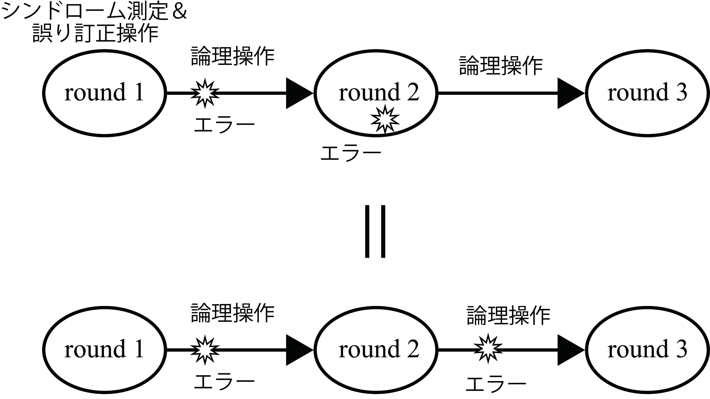
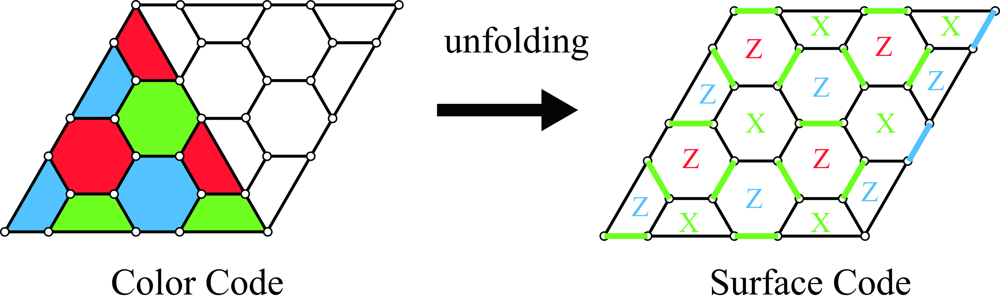
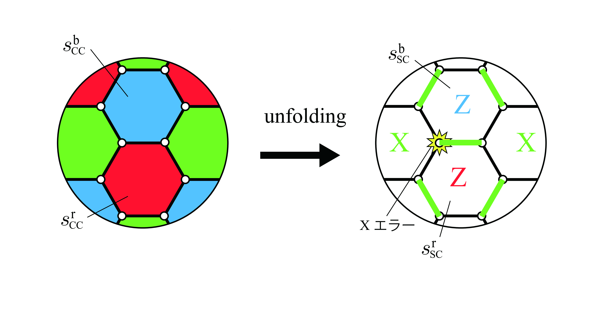
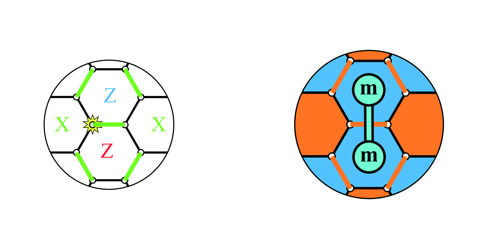
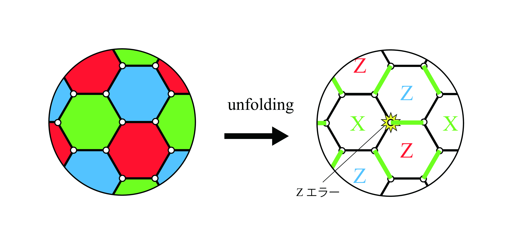
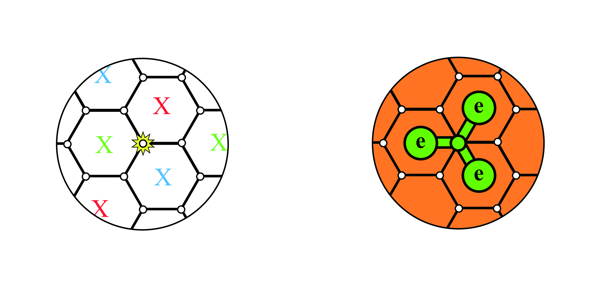
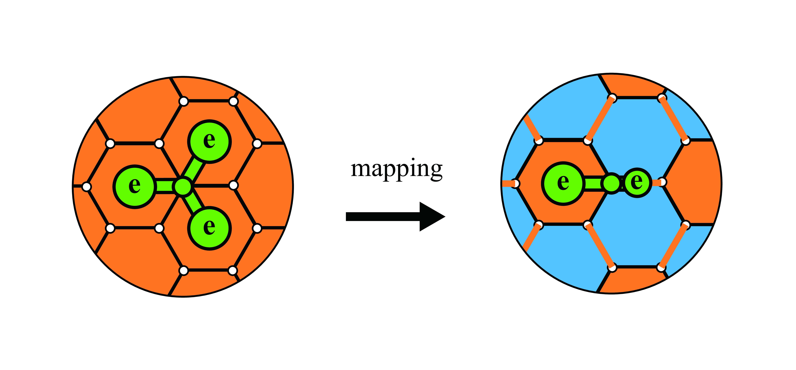
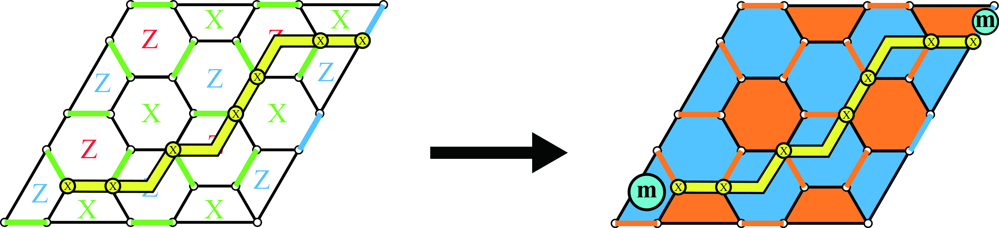
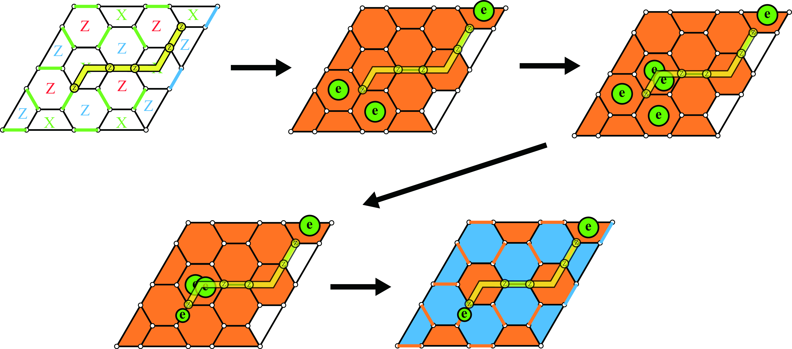
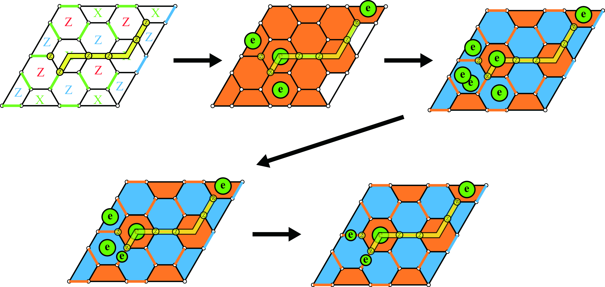

# unfolding Color Codeの誤り耐性

## 仮定

　符号を用いているとき、エラーはシンドローム測定や誤り訂正中に発生しないと仮定する。もし仮にシンドローム測定中や誤り訂正中にエラーが起きたとするならば、それは次のroundで訂正することとする。このことをわかりやすく、Fig.<a href="#figure1" data-reference-type="ref"
data-reference="figure1">1</a>に示した。Fig.<a href="#figure1" data-reference-type="ref"
data-reference="figure1">1</a>に示す通り、round
2の操作時に発生するエラーは、round 2-round
3間の論理操作時に発生するエラーと置き換えることができると仮定するということである。そのため、round
$`t`$ではround $`t-1`$-round $`t`$間のエラーが訂正できれば良い。


<figcaption>Fig. 1</figcaption>

このようなことを前提として以下ではunfolding Color
Codeの誤り耐性、具体的にはColor CodeからSurface
Codeへの変換（Fig.<a href="#figure1" data-reference-type="ref"
data-reference="figure1">1</a>でいうとシンドローム測定）の際に発生したエラーがその変換後に検出できるのかということを確認していく。  

## エラー検出

　まず、Stabilizer
Codeではどのようにしてエラーを検出しているのかということを確認する。ここで、round
$`t`$でのphysical qubitsの状態は$`\ket{\psi}^t`$と表され、round
$`t`$ではエラーは発生していないとする。また、stabilizer
groupを$`\mathcal{S}`$とする。round $`t`$でスタビライザー
$`s_j\in \mathcal{S}`$についてシンドローム測定を行うと、
``` math
\begin{align}
        s_j\ket{\psi}^t=m^{t}_j\ket{\psi}^t
    
\end{align}
```
が成り立つ。ただし、$`m^{t}_j`$はround
$`t`$での$`s_j`$のシンドローム値を表す。スタビライザー符号ではよくスタビライザー状態を$`m_j=1`$として定義するが、実際にエラーを検出するときは$`m=-1`$のときをスタビライザー状態としても同じであり、このときは$`m_j=1`$のときにエラーが発生していることになる。次に、round
$`t`$-round $`t+1`$間で論理操作をし、round
$`t+1`$で$`s_j\in \mathcal{S}`$についてシンドローム測定を行うと、
``` math
\begin{align}
        s_j\ket{\psi}^{t+1}=m^{t+1}_j\ket{\psi}^{t+1}
    
\end{align}
```
が成り立つ。このとき、round $`t`$-round
$`t+1`$間で$`s_j`$によって検出されるようなエラーが発生していたら、$`m^{t+1}`$と$`m^{t}_j`$の符号は逆、すなわち$`m^{t+1}m^{t}_j=-1`$、round
$`t`$-round
$`t+1`$間で$`s_j`$によって検出されるようなエラーが発生していなければ、$`m^{t+1}_{j}`$と$`m^{t}_j`$の符号は同じ、すなわち$`m^{t+1}m^{t}_j=1`$となる。このようなことから、round
$`t`$-round
$`t+1`$でのエラー検出はすべてのスタビライザーに対して、$`m^{t+1}_{j}m^{t}_j`$を考えれば良く、$`m^{t+1}_{j}m^{t}_j=-1`$のとき、エラーが起こったとする。

## unfolding操作でのエラー検出

Color
Codeのunfolding操作はFig.<a href="#figure2" data-reference-type="ref"
data-reference="figure2">2</a>のようにして行われる（詳細は前回の資料unfolding_color_code.pdfを参照）。


<figcaption>Fig. 2</figcaption>

ここでの議論はround
$`t`$でFig.<a href="#figure2" data-reference-type="ref"
data-reference="figure2">2</a>の左の状態、round
$`t+1`$でFig.<a href="#figure2" data-reference-type="ref"
data-reference="figure2">2</a>の右の状態であるとする。また、符号距離は一般の$`d`$のときについて議論する。  
　まずもともとColor
Codeだった領域でunfolding操作中に発生したXエラーに注目する（Fig.<a href="#figure3" data-reference-type="ref"
data-reference="figure3">3</a>）。


<figcaption>Fig. 3</figcaption>

Fig.<a href="#figure3" data-reference-type="ref"
data-reference="figure3">3</a>で見えているスタビライザーについて、Color
Codeのblue face Z スタビライザー、red face Z
スタビライザーをそれぞれ$`s^\text{b}_\text{CC}, s^\text{r}_\text{CC}`$、Surface
CodeのZ スタビライザーでもともとblue face だった部分、red face
だった部分を$`s^\text{b}_\text{SC}, s^\text{r}_\text{SC}`$と表す。また、$`s^i_j`$のシンドローム値を$`m^i_j`$とする。このとき、Fig.<a href="#figure3" data-reference-type="ref"
data-reference="figure3">3</a>に示されているX
エラーというのは$`s^\text{b}_\text{SC}, s^\text{r}_\text{SC}`$のシンドローム値を反転させる。つまり、$`m^\text{b}_\text{SC}m^\text{b}_\text{CC}=-1,\ m^\text{r}_\text{SC}m^\text{r}_\text{CC}=-1`$となり、発生したX
エラーを検出できる。すなわち、Fig.<a href="#figure4" data-reference-type="ref"
data-reference="figure4">4</a>のように、Surface Code上ではanyon
modelを用いて粒子mが発生したのと同じである。あとはSurface
Codeと同じように誤り訂正すれば良い。Boudary部分についても同じような議論ができる。また、もともとColor
Codeではなかった部分のXエラーについても、最初はZ方向に初期化されていることから、操作前のシンドローム値は初期化したときの1つの正六角形状の6つのqubitの測定値の積と、その場所のSurface
Codeのシンドローム値を比べることによってX エラーを検出できる。Bundary
に2-weightスタビライザーが存在する場合があるが、それも同じようにできる。


<figcaption>Fig. 4</figcaption>

　次にもともとColor
Codeだった領域でunfolding操作中に発生したZエラーに注目する（Fig.<a href="#figure5" data-reference-type="ref"
data-reference="figure5">5</a>）。


<figcaption>Fig. 5</figcaption>

unfolding操作の2-weight X スタビライザーはred
faceのZスタビライザーと反可換であるため、いくつかの2-weight X
スタビライザーはundeterministicである。しかし、エラーが存在しなければ、1つのblue
face（red face）上の3つの2-weight X
スタビライザーの積はdeterminisicでColor Codeのときの6-weight X
スタビライザーのシンドローム値と同じでなければならない。すなわち、Fig.<a href="#figure5" data-reference-type="ref"
data-reference="figure5">5</a>のZ エラーは検出できる。また、anyon
modelで表すとFig.<a href="#figure6" data-reference-type="ref"
data-reference="figure6">6</a>となる。


<figcaption>Fig. 6</figcaption>

エラーの位置がわかるので、これをSurface Codeの描像にmappingするとFig.
<a href="#figure7" data-reference-type="ref"
data-reference="figure7">7</a>のようになる。また、$`\ket{0}`$に初期化する領域にはZ
エラーが起きない(？)ので考える必要は無い。あとはSurface
Codeと同じように誤り訂正すれば良い。


<figcaption>Fig. 7</figcaption>

## mapping

実際にSurface Codeの描像へのmappingがうまくできるか検証してみる。  
　まず、X
エラー検出は素直にできる（Fig.<a href="#figure8" data-reference-type="ref"
data-reference="figure8">8</a>）。ここで、黄色のチェインはX
エラーを表す。


<figcaption>Fig. 8</figcaption>

次に、Z エラーの検出だが、これは少し工夫が必要である。Fig.
<a href="#figure9" data-reference-type="ref"
data-reference="figure9">9</a>、Fig.
<a href="#figure10" data-reference-type="ref"
data-reference="figure10">10</a>に2パターン示す。ここで、黄色のチェインはZ
エラーを表す。行っていることは、Surface Codeの描像のanyon
modelで表せるまで、Fig. <a href="#figure7" data-reference-type="ref"
data-reference="figure7">7</a>の形を作って変換しているだけである。本当は右上半分にはZ
エラーは存在しない（？）が、存在しないほうが簡単なのであまり気にしなくても良い。


<figcaption>Fig. 9</figcaption>


<figcaption>Fig. 10</figcaption>

あらゆるパターンをこのように変換できる（？）。
