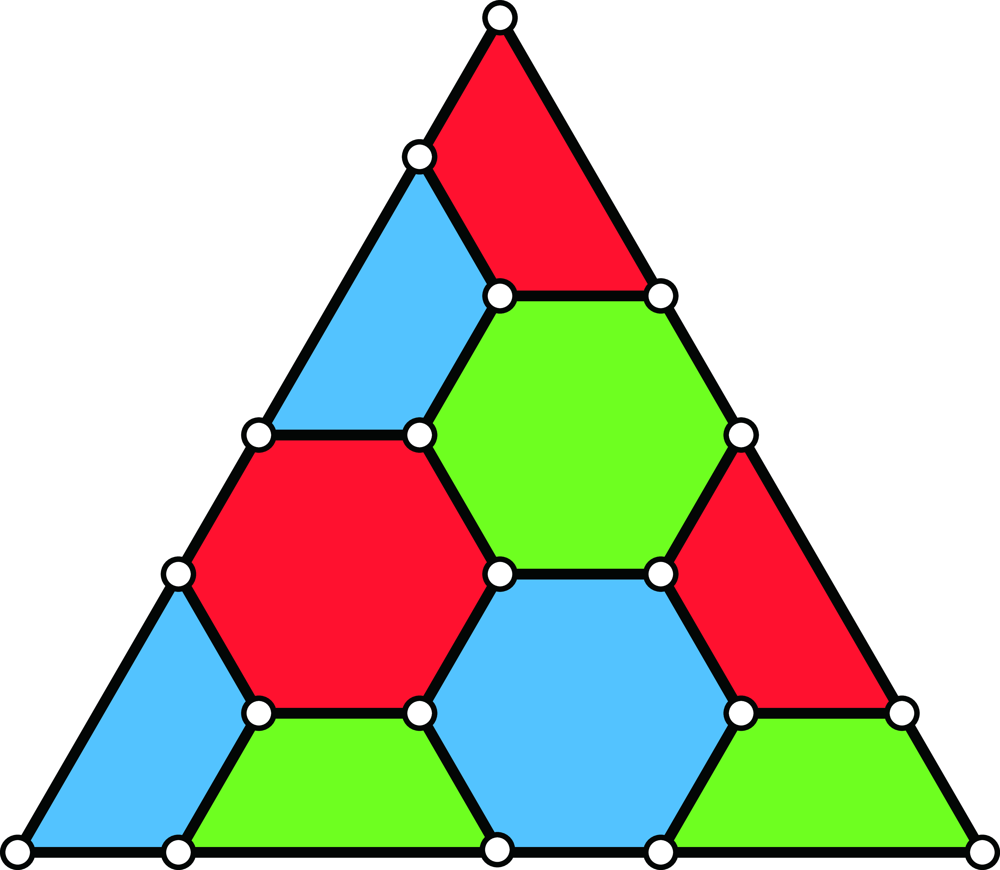
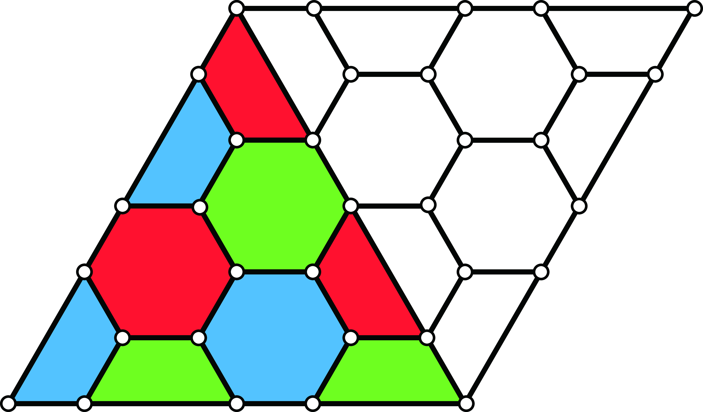
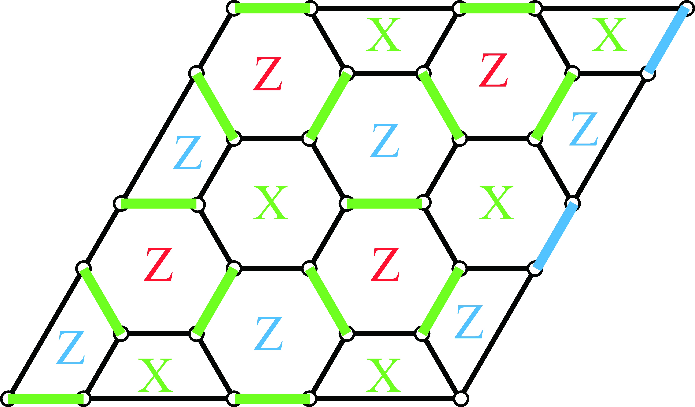
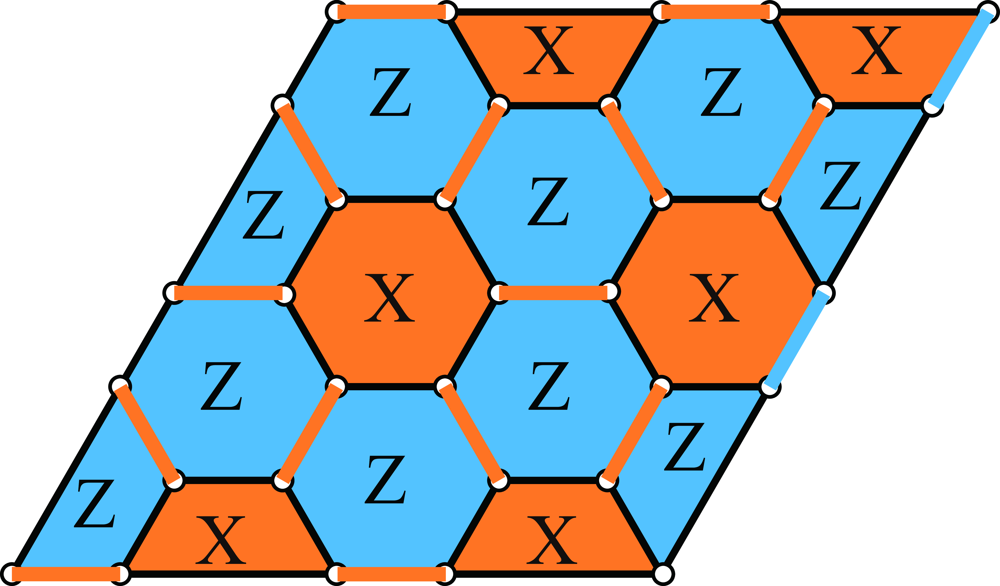
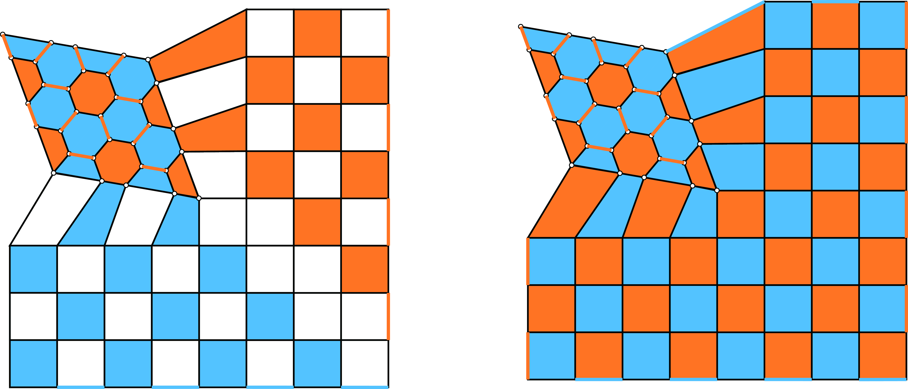
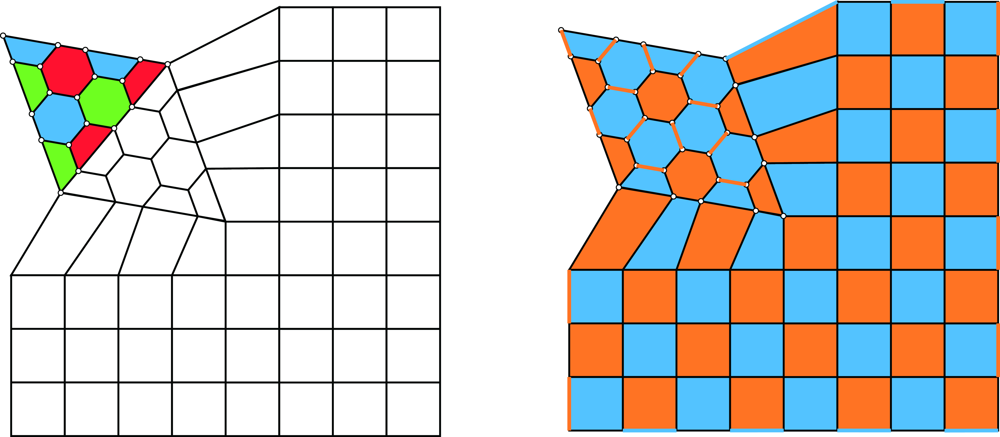

# Dynamical Codeによるunfolding Color Code

　FuとGottesmanのError Correction in Dynamical Codes(Dynamical
CodeはおそらくSubsystemとFloquet Codeの総称)
\[1\]の前半部分を参考にして、GidneyのMagic State Cultivation
\[2\]のColor CodeからSurface Codeへのescapeを考えてみた。

## Dynamical CodeによるColor Codeのunfolding (Color Code → Surface Code)

　ここでは、Fig.<a href="#figure1" data-reference-type="ref"
data-reference="figure1">1</a>のような符号距離5のColor
Codeについて考える。  

<figcaption>Fig. 1</figcaption>

最初にColor CodeのX logical operatorをgreen boundaryに沿う5-weight
operator、Z logaical operatorをred boundaryに沿う5-weight
operatorと定義する。 ここではColor
CodeをFig.<a href="#figure1" data-reference-type="ref"
data-reference="figure1">1</a>のblue
boundaryを折り目として開くことを考える。Color
Codeをunfoldする直前はFig.<a href="#figure2" data-reference-type="ref"
data-reference="figure2">2</a>のように折り目のboudary側に0初期化された量子ビットを、unfoldするColor
Codeの量子ビット数nから符号距離dを引いた$`n-d`$個だけ用意する。

<figcaption>Fig. 2</figcaption>

ここでスタビライザー群を$`\mathcal{S}`$と表す。Fig.<a href="#figure3" data-reference-type="ref"
data-reference="figure3">3</a>のようにgreenのedgeにX edge
stabilizer、boundary上のblue edgeに対してZ edge
stabilizerを$`\mathcal{S}`$に追加する。ただし、追加された量子ビットの領域に対してもColor
Codeが続いているように見て、edge
operatorを定義している。これによって、red faceのZ
stabilizerは$`\mathcal{S}`$から消える。またそれと同時に、green faceのX
stabilizer、red faceのZ stabilizer、blue faceのZ
stabilizerのシンドローム測定を、追加した量子ビットの領域で開始する。そうすると、Fig.<a href="#figure3" data-reference-type="ref"
data-reference="figure3">3</a>のようになる。

<figcaption>Fig. 3</figcaption>

ということで変換後のスタビライザー$`\mathcal{S}`$はSurface
Codeに対応するものとなっており、Fig.<a href="#figure4" data-reference-type="ref"
data-reference="figure4">4</a>に示すようになっている。ただし、橙色がX
stabilizer、青色がZ
stabilizerを表す。ここで定義している6-weightもしくは4-weightのスタビライザーはfloquet
code的に実装するのではなく、surface
codeのように実際のweight分のシンドローム測定を行う。

<figcaption>Fig. 4</figcaption>

ここで、最初に定義したlogical
operatorは追加したすべてのスタビライザーと可換であるため論理情報は保存される(\[1\]を参照)。

## 拡大

　ここまでで、Surface
Codeにできたのであとは拡大するだけである。拡大はFowlerとGidneyの\[3\]のFig.11と同じようにすればできると思う(Fig.<a href="#figure5" data-reference-type="ref"
data-reference="figure5">5</a>)。

<figcaption>Fig. 5</figcaption>

またここまでの操作はいっぺんにやってしまえば良いので、Fig.<a href="#figure6" data-reference-type="ref"
data-reference="figure6">6</a>のように、拡大先のSurface
Codeの量子ビットをすべて用意しておいて、その後全体でSurface
Codeのシンドローム測定をすることによって、escape stageが完成すると思う。

<figcaption>Fig. 6</figcaption>

## 検証

　ここでは、検証を簡単にするために符号距離3の場合について考える。まずはColor
CodeからSurface
Codeへの変換がエラーが無いときに所望の変換になっているかを検証する。ただし、スタビライザーの測定結果はすべて+が出ることを仮定している。Fig.<a href="#figure7" data-reference-type="ref"
data-reference="figure7">7</a>より、Color Codeにエンコードし、Surface
Codeに変換する場合と、最初からSurface Codeに変換する場合でLogical
OperatorとStabilizerが同じであることがわかる。よって、Color
CodeからSurface Codeへの変換は所望の操作になっている。

<figcaption>Fig. 7</figcaption>

また、拡大操作を検証すると、Fig.<a href="#figure8" data-reference-type="ref"
data-reference="figure8">8</a>のようになる。Fig.<a href="#figure8" data-reference-type="ref"
data-reference="figure8">8</a>の上段はFig.<a href="#figure7" data-reference-type="ref"
data-reference="figure7">7</a>の最終状態から、拡大する操作を表し、下段は拡大されたSurface
Codeにエンコードする操作を表す。上段と下段の最終状態は等しいので、拡大操作は所望の操作になっている。

<figcaption>Fig. 8</figcaption>

最後にこれらの操作がいっぺんにできるかを検証する。Fig.<a href="#figure9" data-reference-type="ref"
data-reference="figure9">9</a>に示す通り、Color
Codeからいっぺんに変換、拡大の操作を行っても、Fig.<a href="#figure8" data-reference-type="ref"
data-reference="figure8">8</a>の下段と同じ状態が得られることがわかる。

Update rules from \[1\]

**Lemma 1**. *(**Stabilizer Update Rules**)*

*Let $`\mathcal{S}`$ be the stabilizer generators with a stabilizer
state $`\ket{\psi}`$ being either in $`+1`$ or $`-1`$ eigenstate of the
generators.*

*Let $`m`$ be a Pauli measurement performed on $`\ket{\psi}`$, and
denote the outcome of $`m`$ by $`O(m)\in \{\pm 1\}`$.*

1.  *If $`\pm m \in \langle \mathcal{S} \rangle`$, then the outcome is
    fixed by the eigenvalues of stabilizers for $`\ket{\psi}`$, and the
    state remains unchanged.*

2.  *If $`m`$ anti-commutes with some elements in $`\mathcal{S}`$: Let
    $`V = \{s_1, s_2,\cdots, s_l\}`$ be a subset of $`\mathcal{S}`$
    whose elements anti-commute with $`m`$. We replace $`s_1`$ with
    $`m`$ and update the rest of $`V`$ by $`s_i \to s_i \cdot s_1`$, for
    $`2 \leq i\leq l`$. $`\mathcal{S} \cap V`$ is now updated to
    $`\{O(m) \cdot m, s_2\cdot s_1, s_3 \cdot s_1,\cdots, s_l\cdot s_1\}`$*

3.  *If $`\pm m \notin \langle \mathcal{S} \rangle`$ and
    $`[m,s]=0 \, \forall s \in \mathcal{S}`$, then we update the set of
    stabilizer generators:
    $`\mathcal{S} \to \mathcal{S} \cup \{O(m) \cdot m\}`$. This assumes
    that $`m`$ is not a logical operator.*

**Lemma 2**. *(**Logical Update Rules**)*

*Let $`L`$ be a logical operator of a stabilizer group
$`\langle S\rangle`$ and let $`\ket{\psi}`$ be an eigenstate of $`L`$.*

*Let $`m`$ be a Pauli measurement performed on $`\ket{\psi}`$ and denote
the outcome by $`O(m) \in \{\pm 1\}`$.*

1.  *If $`m = (-1)^a \cdot L`$, then $`O(m)\cdot (-1)^a`$ gives the
    eigenvalue of $`L`$ for the state $`\ket{\psi}`$, and the logical
    operator remains unchanged.*

2.  *If $`m`$ commutes with $`L`$, the logical operator remains
    unchanged.*

3.  *If $`m`$ anti-commutes with $`L`$ and commutes with
    $`\langle S\rangle`$, then $`L`$ is updated to $`O(m) \cdot m`$. The
    new state is a $`+1`$ eigenstate of $`O(m) \cdot m`$ instead of
    $`L`$.*

4.  *If $`m`$ anti-commutes with $`L`$ and anti-commutes with some
    elements in $`S`$: In the stabilizer update rules, we replace an
    element $`s_1`$ with $`m`$ and update the rest of the elements in
    $`S`$ that anti-commute with $`m`$ using the $`2^{\mathrm{nd}}`$
    rule in Lemma
    <a href="#lemma: stab update rule" data-reference-type="ref"
    data-reference="lemma: stab update rule">1</a>. For the logical
    operator, we update $`L\to L\cdot s_1`$, where $`s_1`$ is the
    element that is replaced with $`m`$.*

## REFERENCE

\[1\]
X. Fu and D. Gottesman, “Error
correction in dynamical codes,” *arXiv preprint*, 2024, Available:
<https://arxiv.org/abs/2403.04163>

\[2\]
C. Gidney, N. Shutty, and C.
Jones, “Magic state cultivation: Growing t states as cheap as CNOT
gates,” *arXiv preprint*, 2024, Available:
<https://arxiv.org/abs/2409.17595>

\[3\]
A. G. Fowler and C. Gidney, “Low
overhead quantum computation using lattice surgery,” *arXiv preprint*,
2019, Available: <https://arxiv.org/abs/1908.06709>

